<!-- Using the following project as a reference: https://github.com/othneildrew/Best-README-Template/tree/main -->

<a id="readme-top"></a>
<br />
<div align="center">
  <h1 align="center">Automatic Audio Captioning</h1>

  <p align="center">
    Automatic audio captioning project for the AI with DL postgraduate course at the UPC.
    <br />
    <br />
    <a>
        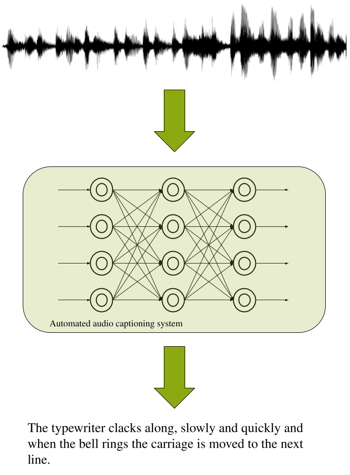
  </a>
  </p>
</div>

<!-- TABLE OF CONTENTS -->
<details>
  <summary>Table of Contents</summary>
  <ol>
    <li>
      <a href="#introduction">Introduction</a>
    </li>
    <li>
      <a href="#about-the-project">About The Project</a>
      <ul>
        <li><a href="#motivation">Motivation</a></li>
        <li><a href="#objectives">Objectives</a></li>
        <li><a href="#schedule">Schedule</a></li>
      </ul>
    </li>
    <li>
      <a href="#objectives-main">Objectives</a>
      <ul>
        <li>
          <a href="#understand-stat-of-the-art-aac-systems">1. Understand state of the art AAC systems</a>
          <ul>
            <li><a href="#objective1-introduction">Introduction</a></li>
            <li><a href="#objective1-model-architectures">Model Architectures</a></li>
            <li><a href="#objective1-training-strategies">Training Strategies</a></li>
            <li><a href="#objective1-evaluation-metrics">Evaluation Metrics</a></li>
          </ul>
        </li>
        <li>
          <a href="#objective2-baseline-models">2. Baseline models replication</a>
          <ul>
            <li>
              <a href="#objective2-dcase-2024-challenge-baseline-replication">DCASE 2024 challenge baseline replication</a>
              <ul>
                <li><a href="#objective2-introduction">Introduction</a></li>
                <li><a href="#objective2-prerequisites">Prerequisites</a></li>
                <li><a href="#objective2-installation">Installation</a></li>
                <li><a href="#objective2-training-process">Training Process</a></li>
                <li><a href="#objective2-results">Detailed results</a></li>
                <li><a href="#objective2-conclusions">Conclusions</a></li>
              </ul>
            </li>
            <li><a href="#objective2b-clap">CLAP replication</a></li>
            <li><a href="#objective2c-demos">DCASE 2024 and CLAP demo deployment</a></li>
          </ul>
        </li>
        <li>
          <a href="#objective3-modify-and-adjust">3. Modify the decoder architecture and adjust training strategies</a>
          <ul>
              <li><a href="#objective3-update">UPDATE: Explore Hyperparameters to improve training results</a></li>
          </ul>
        </li>
        <li><a href="#objective4-gain-insights">4. Gain insights into audio captioning and deep learning</a>
        </li>
      </ul>
    </li>
  </ol>
</details>


<a id="introduction"></a>
# Introduction

Automatic Audio Captioning (AAC) is the task of generating natural language descriptions for audio recordings. It involves analyzing complex acoustic signals and translating them into human-readable text, often describing specific sound events, their interactions, or environmental context. This process combines signal processing, deep learning, and natural language processing techniques. In contrast to automatic speech recognition (ASR), audio captioning prioritizes environmental sounds while disregarding any speech content that might be present in an audio clip, and thus it is not about transcribing the voice content of what a speaker might be saying.

Recent advancements in deep learning have significantly improved AAC performance. Traditional approaches relied on handcrafted audio features such as Mel-Frequency Cepstral Coefficients (MFCCs) and statistical models, but modern systems predominantly use neural networks. Convolutional Neural Networks (CNNs) are commonly employed for feature extraction, transforming raw waveforms or spectrogram representations into high-level embeddings (see [Figure 1](#fig-aac-pipeline)). These embeddings are then processed by sequence models such as Recurrent Neural Networks (RNNs), Transformer architectures, or attention mechanisms to generate coherent textual descriptions.

<p align="center">
  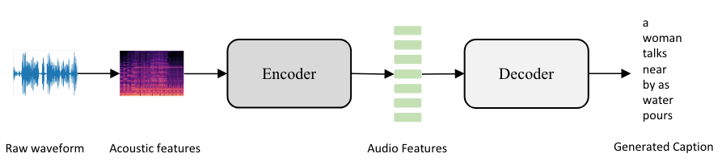
</p>
<p align="center"><a id="fig-aac-pipeline"></a><em>Figure 1: Overview of a typical AAC pipeline</em></p>

<a id="about-the-project"></a>
# About the project

<a id="motivation"></a>
## Motivation

AAC represents a cutting‐edge intersection of audio signal processing and natural language generation with significant real-world impact. The practical applications of AAC are manifold—from enhancing accessibility for the hearing-impaired and augmenting multimedia retrieval systems to serving as a critical component in intelligent monitoring and human–machine interaction. In parallel, the emergence of challenges such as [DCASE 2024](#dcase2024) has highlighted the growing research momentum and industry relevance of AAC. The DCASE challenge not only benchmarks state-of-the-art methods but also catalyzes innovation by providing a structured platform for evaluating model performance under diverse conditions. This project is driven by the dual purposes of exploring AAC’s promising practical implementations and taking into account the insights gained from DCASE 2024 to refine and advance current methodologies.

<a id="objectives"></a>
## Objectives

Thus, the **objectives of this project** include investigating and experimenting with AAC by systematically analyzing state-of-the-art methods, replicating established baselines, and evaluating modifications to model architectures. The specific key goals are as follows:

1. **Understand state-of-the-art AAC systems**  
   A comprehensive review of recent developments in AAC will be conducted, focusing on model architectures, training strategies, and evaluation metrics. This includes analyzing encoder-decoder frameworks, transformer-based approaches, and techniques used to improve caption generation quality.

2. **DCASE 2024 challenge baseline replication**  
   The DCASE Challenge 2024 baseline model will be deployed and trained from scratch to assess the feasibility of reproducing reported benchmark metrics. This process will validate the reproducibility of existing AAC models and serve as a reference point for subsequent experiments.
 
3. **Modify the decoder architecture and adjust training strategies**  
   Modifications to the decoder architecture will be introduced to analyze their impact on performance. Particular attention will be given to model explainability, with a focus on interpreting attention weights and understanding how the model processes audio representations. Alternative training strategies will also be explored to optimize performance and generalization.

4. **Gain insights into audio captioning and deep learning**  
   Through experimentation and analysis, broader insights into AAC model behavior, limitations, and potential improvements will be gathered. This includes understanding the trade-offs between model complexity, explainability, and performance and identifying directions for future research in audio captioning.

This structured approach ensures a methodical evaluation of AAC systems, contributing both to theoretical understanding and practical advancements in the field.

> [!UPDATE]
> After studing the DCASE baseline model and trying to use different decoder types like BERT [process explained here](#objective3) for the caption generation process, we concluded that with the time and resources we had left, it was maybe a bit too ambitious objective. Hence, we decided to change it by dropping the decoding modification part (within objective 3) and focus on how to improve the training by exploring different **Hyperparameter** specifications.

<a id="schedule"></a>
## Schedule

The project is scheduled to run from December 1st to March 17th.  [Figure 2](#fig-schedule) provides an overview of the main objectives and corresponding tasks.


<p align="center">
  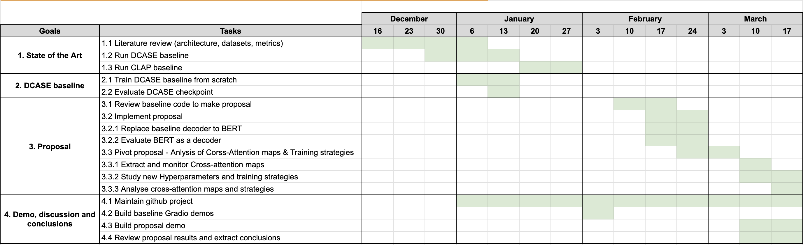
</p>

<p align="center"><a id="fig-schedule"></a><em>Figure 2: Project schedule</em></p>

The first goal, state-of-the-art review, was scheduled for completion by the end of January. Key tasks include conducting a literature review on architecture, datasets, and common evaluation metrics, as well as deploying the existing trained DCASE and CLAP baselines.

The second goal involves training the DCASE model from scratch using a virtual machine and comparing its performance against benchmarked metrics. This phase was also expected to be completed by the end of January.

The third goal focuses on evaluating the current model architecture, modifying it, retraining, and testing it to assess performance improvements. Additionally, for explainability, tasks include generating attention maps, analyzing model weights, and identifying the frames the model prioritizes when generating captions. These activities take place throughout February, with final explainability analysis conducted in early March.

Lastly, the fourth goal involves synthesizing all gathered insights and conducting the final discussion and conclusions. This phase is scheduled for the last weeks of the project in March.


<p align="right">(<a href="#readme-top">back to top</a>)</p>

<a id="objectives-main"></a>
# Objectives 

<a id="understand-stat-of-the-art-aac-systems"></a>
## 1. Understand state-of-the-art AAC systems

<a id="objective1-introduction"></a>
### Introduction

Automated Audio Captioning (AAC) has emerged as a prominent cross-modal translation task, aiming to generate natural language descriptions for audio clips. This task bridges the gap between audio signal processing and natural language processing (NLP). Recent progress has been significantly driven by deep learning techniques and the availability of datasets like Clotho. 

Recent advances in AAC have progressively enhanced the ability to generate natural language descriptions for audio content. Early work in the field established the feasibility of the task by employing encoder–decoder frameworks based on RNNs with attention mechanisms. For example, [Drossos et al. (2017)](#drossos2017) introduced one of the first AAC systems using bi-directional gated recurrent units (GRUs) to capture temporal dynamics and an alignment model to focus the decoder on relevant audio features. While this approach demonstrated promising results, it also highlighted challenges in modeling long-range dependencies and the fine-grained acoustic details required for accurate captioning.

Subsequent research shifted towards leveraging CNNs and their hybrid forms (e.g., CRNNs) to improve feature extraction. CNN-based encoders proved effective at capturing local patterns and robust audio representations from spectrogram inputs. However, due to the inherent limitations of fixed receptive fields in CNNs, these methods often struggled to capture global contextual information across longer audio sequences.

A major turning point in AAC research has been the introduction of Transformer architectures. Transformer-based models, such as the Audio Captioning Transformer (ACT) presented in the 2021 DCASE work [(Mei et al., 2021)](#Mei2021), employ self-attention mechanisms that allow the model to directly model long-range dependencies. This approach enables a more holistic understanding of the audio input, resulting in improved coherence and contextual accuracy in the generated captions.

The most recent advances have integrated ideas from the computer vision domain to further enhance audio encoding efficiency. The CoNeTTE system [(Labbé et al., 2023)](#Labbe2023)  exemplifies this trend by adapting a ConvNeXt architecture—originally designed for image classification—for audio feature extraction. The incorporation of dataset-specific task embeddings to address biases arising from pre-training on large-scale audio tagging datasets makes CoNeTTE achieve competitive performance while significantly reducing the number of parameters compared to previous models.

Despite these advances, several challenges persist. Current systems still face limitations due to the scarcity of high-quality annotated datasets, potential biases inherited from pre-trained models, and difficulties in capturing the complex temporal and contextual relationships present in natural audio signals. Future research is likely to focus on developing more robust, data-efficient models and on further refining multi-modal approaches to close the gap between machine-generated and human-level descriptions.

Down below we summarize key developments in model architectures, training strategies, and evaluation metrics within the AAC field.

<p align="right">(<a href="#readme-top">back to top</a>)</p>

<a id="objective1-model-architectures"></a>

### Model Architectures

The encoder-decoder framework is a prevalent architecture in AAC systems. As illustrated in Figure 1 [ paper reference CoNette], the encoder processes the input audio clip, and the decoder generates the corresponding caption.

<p align="center">
  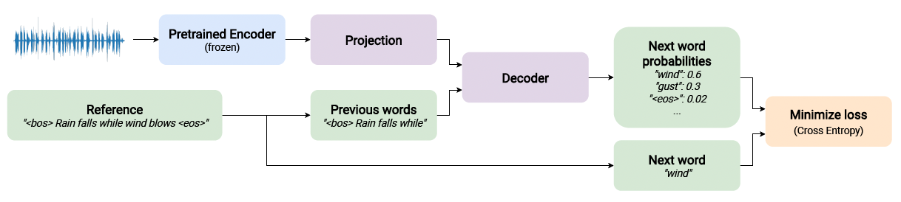
</p>

The model is composed by an audio encoder which produces a frame-level audio representation of the audio and a captioning decoder which produces the next word distribution according to the previous words and to the audio. This process is repeated for each word in the reference, except for the Begin-Of-Sentence (<bos>) token.

Encoders extract audio features using various neural networks types, including:

- **Recurrent Neural Networks (RNNs):** Early approaches utilized RNNs (e.g., GRUs, LSTMs) to model temporal relationships in audio. For instance, Drossos et al. (cited within the provided paper) used a three-layered bi-directional GRU network as the encoder. RNNs process audio as a time-series signal, where the hidden states of the last layer of the RNN are regarded as the audio feature sequences, which are then fed into the text decoder for caption generation.
  - ***Challenges:*** RNNs alone may struggle with long-range dependencies, making it difficult to learn the correspondence between words and audio features.Also, using RNNs alone as the encoder is not found to give strong performance.
  - ***Advantages:*** RNNs are simple to implement and designed to process sequential data of variable lengths.

- **Convolutional Neural Networks (CNNs):** Adapted from computer vision, CNNs excel at extracting robust audio patterns. Figure 3 of the paper illustrates a typical CNN audio encoder.

  <p align="center">
    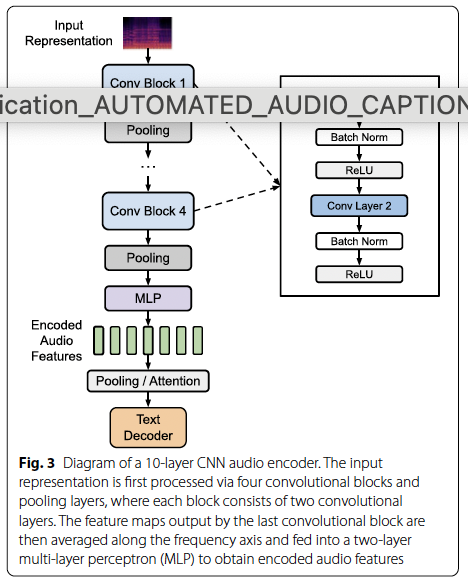
  </p>

  - ***Challenges:*** CNNs struggle to capture the temporal dependencies within audio signals effectively.
  - ***Advantage:*** CNNs show powerful ability in extracting robust audio patterns

- **Transformers:** Have gained popularity due to their ability to model long-range dependencies effectively. Transformers can capture dependencies between distant parts of the audio signal, enabling the model to generate more coherent and contextually relevant captions.
  - ***Challenges:*** Transformers are computationally expensive and require large amounts of training data.
  - ***Advantages:*** Transformers excel at modeling long-range dependencies and can process the input sequence in parallel.

Decoders, typically RNNs or Transformers, generate captions based on the encoded audio features. The decoder generates a sentence S = {w1, ..., wN}, where wn is a word and N is the number of words in the sentence. The sentence is typically generated from left to right in an auto-regressive manner.

<p align="right">(<a href="#readme-top">back to top</a>)</p>

<a id="objective1-training-strategies"></a>

### Training Strategies

Recent developments in AAC training strategies focus on addressing key challenges and improving model performance. The main approaches include:
 
 - **Cross-Entropy Training:** Cross-entropy (CE) loss with maximum likelihood estimation remains a standard approach for training AAC models5. It uses a 'teacher-forcing' strategy during training, minimizing the negative log-likelihood of the ground truth word given previous ground truth words. While effective at generating syntactically correct sentences, it has limitations [(Mei et al., 2022)](#Mei2022):
    - ***Exposure Bias:*** Discrepancy between training (using ground truth words) and testing (using generated words) conditions leads to error accumulation
    - ***Generic Captions:*** Models tend to produce simple, generic captions rather than specific, detailed descriptions
 
 - **Reinforcement Learning:** Reinforcement learning (RL) addresses some limitations of CE training[(Mei et al., 2021)](Mei2021b):
    - ***Optimizing Evaluation Metrics*** RL directly incorporates non-differentiable evaluation metrics into the optimization process
    - ***Mitigating Exposure Bias*** By allowing the model to explore its own output space during training

 - **Transfer Learning:** To combat data scarcity in AAC[(Mei et al., 2021)](Mei2021b):
    - ***Pre-trained Audio Encoders*** Using models like PANNs significantly improves performance across evaluation metrics
    - ***Cross-Modal Transfer*** Pre-training on larger datasets like AudioCaps enables knowledge transfer in both audio and language modalities

- **Weakly-Supervised Approaches:** Recent work proposes training AAC models using only text data and pre-trained **CLAP (Contrastive Language-Audio Pretraining)** models, reducing the need for paired audio-caption data [(T.Kouzelis, 2023)](#Kouzelis2023)

- **Continual Learning:** Approaches for adapting pre-optimized AAC models to new information without forgetting previous knowledge are being explored[(J. Berg, 2023)](#jberg2023).

While these strategies show promise, their effectiveness can vary across datasets and implementations. Ongoing research continues to refine and combine these approaches to improve AAC performance.

<p align="right">(<a href="#readme-top">back to top</a>)</p>

<a id="objective1-evaluation-metrics"></a>

### Evaluation Metrics

The evaluation of AAC systems involves metrics that assess the quality and relevance of generated captions compared to human-generated references. Common metrics include:

 - **BLEU (Bilingual Evaluation Understudy):** Measures the n-gram overlap between the generated caption and reference captions.
 - **ROUGE (Recall-Oriented Understudy for Gisting Evaluation):** Measures the overlap of n-grams, word sequences, and word pairs between the generated caption and reference captions.
 - **CIDEr (Consensus-based Image Description Evaluation):** Measures the similarity between the generated caption and reference captions based on term frequency-inverse document frequency (TF-IDF) weighting.
 - **SPICE (Semantic Propositional Image Captioning Evaluation):** Evaluates the semantic content of the generated captions by extracting semantic propositions and comparing them to those in the reference captions.
 - **METEOR (Metric for Evaluation of Translation with Explicit Ordering):** Based on explicit word-to-word matching between the generated and reference captions.
 - **Word Error Rate (WER):** WER is based on the Levenshtein distance and represents the number of edits needed to change one sequence into the other.
Despite these advancements, a significant gap remains between machine-generated and human-level captions, highlighting the need for future research.

<p align="right">(<a href="#readme-top">back to top</a>)</p>

<a id="objective2-baseline-models"></a>

## 2. Baseline models replication

<a id="objective2-dcase-2024-challenge-baseline-replication"></a>
### DCASE 2024 challenge baseline replication

<a id="objective2-introduction"></a>

#### Introduction

> [!NOTE]
> Victor si puedes revisar que en este punto no me haya dejado nada o que no esté diciendo nada que no sea cierto.

Manage to deploy the DCase baseline model into our server, will provide the needed foundation for the project. As the rest of the objectives will revolve around this model it is critical that we succeed on running the model to study it. 

This project is founded on cloud-based infrastructure, specifically Google Cloud, to handle the extensive computational requirements associated with the large dataset used. Due to the substantial size of the dataset and the complexity of model training, the project utilizes Google Cloud's Virtual Machines (VMs) with specialized GPU support for efficient processing.

<p align="right">(<a href="#readme-top">back to top</a>)</p>

<a id="objective2-prerequisites"></a>

#### Prerequisites
##### Hardware
The machine configuration is as follows:

- **Machine Type:** g2-standard-4  
This machine type is equipped with 4 vCPUs and 16 GB of memory, offering an appropriate balance of resources for handling data preprocessing and model training tasks.

- **GPU:** 1 x NVIDIA L4 GPU
The NVIDIA L4 GPU was chosen for its optimized performance in deep learning tasks, ensuring fast training and inference times for large models and datasets.

- **Architecture:** x86-64
The x86-64 architecture ensures compatibility with most modern computational frameworks and libraries used in machine learning and deep learning tasks.
<a id="objective2-installation"></a>
### Installation

Essentially the installation process requires 4 parts: 
- **1.Prepare Environment and Install Repository**
Create the environment, download the repository and install the different dependencies.

- **2.Download External Models (ConvNeXt for Feature Extraction)**
The baseline model relies on ConvNeXt, a deep convolutional network originally developed for image classification, adapted here for audio feature extraction. This model is pretrained on AudioSet and serves as the encoder, converting raw audio waveforms into feature embeddings.

    The script automatically downloads ConvNeXt’s pretrained weights from a specified repository.
    These weights are used to generate audio feature representations, which are then passed to the Transformer decoder for caption generation.

- **3.Download Clotho Dataset**
The Clotho dataset v2 is the primary dataset for training and evaluation. It contains audio clips ranging from 15 to 30 seconds, each paired with five human-annotated captions.

    The dataset is automatically downloaded using aac-datasets, a Python package that provides easy access to standard AAC datasets.
    The Clotho dataset is structured into train, validation, and test subsets, ensuring a standardized benchmarking setup.

- **4.Preprocess Data & Create HDF Files**
Before training, the raw audio files need to be converted into a structured format for efficient processing.

    Mel-spectrogram features are extracted from each audio file using the ConvNeXt encoder.
    The preprocessed features, along with captions, are stored in HDF5 (Hierarchical Data Format) files using torchoutil.
    This structured format speeds up data loading during training and evaluation, reducing the need for redundant computations.

> [!NOTE]
> The DCASE Baseline repository provides a series of scripts that help with this process in case one decides to not do it manually.

We have created different guides and scripts that helps to prepare install and lunch the DCASE Baseline into a GPU instance.

> For a step by step guide to create the environment, please check the following [Environment Setup](doc/README_baseline_setps.md).
>
> Once we have the environment created please follow the next step by step guide: [Installing & deploying DCASE baseline Instructions](doc/README_baseline.md).

<p align="right">(<a href="#readme-top">back to top</a>)</p>

<a id="objective2-training-process"></a>

#### Training Process

Once the dataset is prepared, model training follows the standard PyTorch Lightning workflow:

- **1.Initialize Components:**
  - ***Callbacks*** – Custom functions for logging, model checkpointing, and early stopping.
  - ***Tokenizer*** – Processes text input, converting words into token sequences suitable for the Transformer decoder.
  - ***Datamodule*** – Manages dataset loading, batching, and preprocessing.
  - ***Model*** – Defines the architecture, loss function, and optimization strategy.

- **2.Train the Model:**
  PyTorch Lightning simplifies training by handling multi-GPU training, logging, and validation.
  The model is trained to minimize captioning loss, ensuring the generated text closely matches human-annotated captions. 

- **3.Evaluate the Model:**
  After training, the model’s performance is assessed using aac-metrics, a package that computes SPIDEr-FL, METEOR, CIDEr, BLEU, and ROUGE scores.
  The results are compared with official DCASE Challenge benchmarks to ensure consistency.

<p align="right">(<a href="#readme-top">back to top</a>)</p>

<a id="objective2-results"></a>

#### Detailed results

| Metric | Score on Clotho-eval | Score on our server |           
| --- | --- | --- |                                 
| BLEU-1 | 0.5948 | 0.60076 |                       
| BLEU-2 | 0.3924 | 0.40016 |
| BLEU-3 | 0.2603 | 0.27183
| BLEU-4 | 0.1695 | 0.18060
| METEOR | 0.1897 | 0.18706
| ROUGE-L | 0.3927 | 0.39235
| CIDEr-D | 0.4619 | 0.48064
| SPICE | 0.1335 | 0.13289
| SPIDEr | 0.2977 | 0.30676
| SPIDEr-FL | 0.2962 | 0.30551
| SBERT-sim | 0.5059 | 0.50817
| FER | 0.0038 | 0.00765
| FENSE | 0.5040 | 0.50456
| BERTScore | 0.9766 | 0.97755
| Vocabulary (words) | 551 | 523


Image of the training results here:

  <p align="center">
    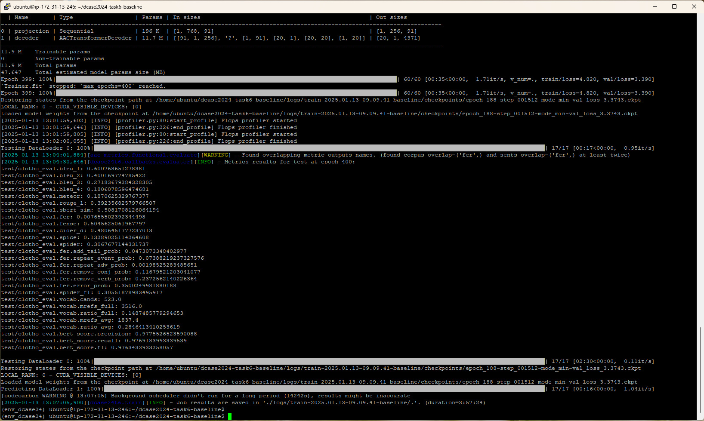
  </p>

<p align="right">(<a href="#readme-top">back to top</a>)</p>

<a id="objective2-conclusions"></a>
#### Conclusions 

After overcoming challenges related to dependency management and securing a cost-effective GPU instance within the Google Cloud environment, we successfully deployed the DCASE baseline model. Subsequently, we proceeded with training the model and conducted a comparative analysis against the results reported in the DCASE Challenge. As demonstrated in the figures below, our training results outcomes closely align with those obtained in the challenge proving that our installation and deployment of the baseline model has been successful. 

<p align="right">(<a href="#readme-top">back to top</a>)</p>

<a id="objective2b-clap"></a>

## CLAP replication

<p align="right">(<a href="#readme-top">back to top</a>)</p>

<a id="objective2c-demos"></a>

## DCASE 2024 and CLAP demo deployment

> [!NOTE]
>  Victor y/o Martí me podeis explicar con un poco más de detalle la demo?

To enhance the accessibility and user engagement of the AAC project, the DCASE 2024 baseline model and CLAP demo have been deployed as an [interactive web application on Hugging Face Spaces](https://huggingface.co/spaces/mumbert/automatic-audio-captioning-demo). This platform allows users to seamlessly experience the capabilities of the models through a user-friendly interface (see [Figure 3](#fig-example-demo)).

The application provides two primary modes for audio input:

- **Microphone Input**: Users can record audio directly using their device's microphone.
- **File Upload**: Users can upload audio files for processing.


<p align="center">
  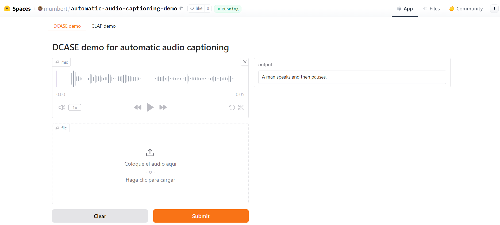
</p>
<p align="center"><a id="fig-example-demo"></a><em>Figure 3: Example of the DCASE demo deployment employing microphone input for audio recording.</em></p>

For more information on the demo, please check the following [demo README](doc/README_demo.md).


<p align="right">(<a href="#readme-top">back to top</a>)</p>

## Usage

In this section we can provide some simple commands to test the installation works, but we might want to put multiple commands on a separate readme file. We can also have separate notebooks if we have time on a separate folder for different configurations, training processes, etc.

For more information on using this project, please check the following [usage README](doc/README_usage.md).

<p align="right">(<a href="#readme-top">back to top</a>)</p>


## Roadmap

We can list here while working on the project some roadmap items or we can even leave here what could eventually be done in the future.

- [x] github project: create project and push initial README file
- [ ] Test baseline
- [ ] Review DCASE dataset
- [ ] Review DCASE metrics

<p align="right">(<a href="#readme-top">back to top</a>)</p>

<a id="objective3-modify-and-adjust"></a>
## 3. Modify the decoder architecture and adjust training strategies</a>

> Content here: Roger

<p align="right">(<a href="#readme-top">back to top</a>)</p>

<a id="objective4-gain-insights"></a>

## 4. Gain insights into audio captioning and deep learning

<a id="objective4-explainability"></a>

### Approach to explainability

Given the transformer-based architecture of the DCASE baseline code, our approach to explainability focuses on getting the attention maps and analyzing them. The originally released code did not provide such feature so we consider this a challenging and interesing enough task to work on for the project.

There multiple files that need to be modified in order to be able to log in the tensorboard some examples of attention maps. In short, what we want to achieve is to:
- perform the analysis via the tensorboard. the original project already makes use of it to log the evolution of the loss values.
- log the attention plots aligned with the tokens
- if possible, make use of some NLP libraries to highlight where the actual item is detected in the attention map (just for some relevant words like verbs and nouns).

More details are provided in the next subsection.

<a id="objective4-modified-code"></a>

### Modified code

There are 2 kind of files which had to be modified:
- pytorch library files in order to be able to store the attentio maps in the decoder layers.
- audio captioning code of the baseline model in order to log it in tensorboard, realize plots, and detect relevant words.

These are the files:
- from the pytorch library:
  - sfg
- from the baseline code:
  - `src/conf/expt/baseline.yaml`: where we have used `beam_size: 1` in order to avoid having to backtrack the best path.
  - `src/dcase24t6/models/trans_decoder.py`: 
    - [decode_audio()](missing link once merged): this function is the wrapper used to generate the encoded audio embeddings into a sequence of words. There are several modes of using it, like `forcing` (for teacher forcing while training), or `generate` while at inference. In the second case, we are interested to provide the sequence of words from the decoded tokens apart from the original string. This is to be able to directly assign time-stamps to the different tokens. That is why we save the list of candidates in `cands_list` variable.
    - [validation_step()](missing link once merged): it is during the validation step that the logging of the attention maps is produced. each time the function is called one example is logged, and given the amount of files for validation this happens a total amount of 17 times. At the end of the validation process that are 17 plots saved for exploration.
    - [plot_attention()](missing link once merged): 
       - this function is called within the validation step in order to make the plot and log it using the `.add_figure()` function of the tensorboard logger. plots are not actually saved as files, but inserted in the tensorboard dashboard instead for exploration.
       - we call this function for each layer in the decoder and also for the mean of all layers.
       - we are able to convert from frames to time since the hop_size is 320ms as specified in the configuration. This, 10 frames correspond to 3.2 seconds, for instance. 
    - [add_time_stamps_to_tags()](missing link once merged): this function is called within the plot_attention function in order to be able to print a subtitle that combines all decoded tokens with some time stamps, only the once related to relevant words like nouns and verbs. We use the NLTK library to detect the part-of-speech tag of the different words in the sentence.

<a id="objective4-examples"></a>

### Attention maps examples

In this section we show some attention maps examples with their corresponding audio samples used as input:

<a id="objective4-examples1"></a>

#### Example 1

- Decoded sentence: ```a train approaches and passes by on the tracks```
- Audio:

<p align="center">
  <audio controls>
    <source src="doc/audios/140815_drezyna_3.wav" type="audio/wav">
    Your browser does not support the audio element.
  </audio>
</p>

 - Attention map:

<p align="center">
  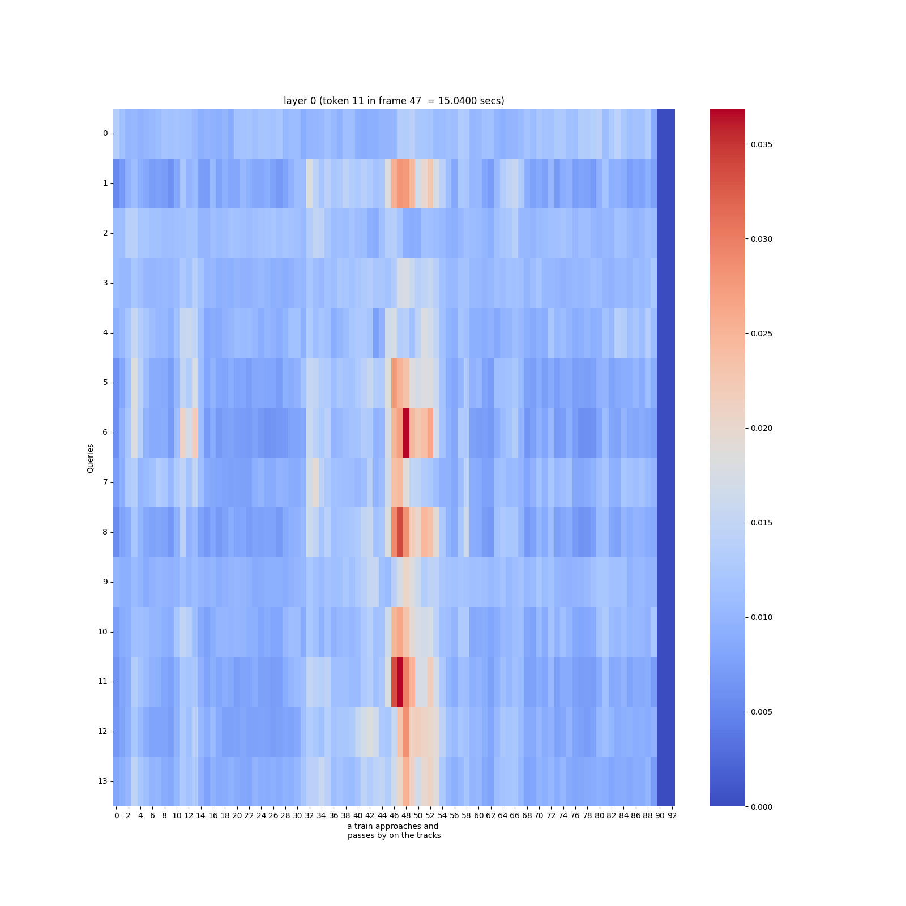
</p>
<p align="center"><a id="fig-example-demo"></a><em>Figure 4: Attention map example</em></p>

- Audio waveform:

<p align="center">
  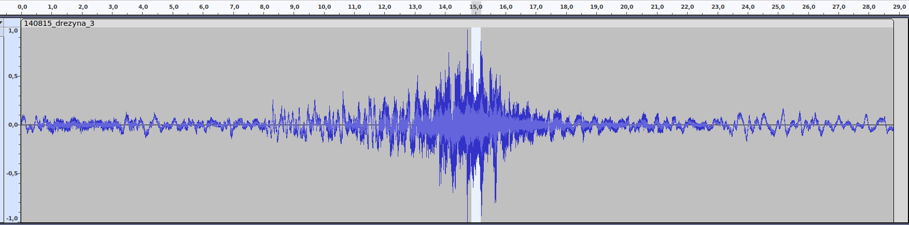
</p>
<p align="center"><a id="fig-example-demo"></a><em>Figure 5: Audio</em></p>


<p align="center">
  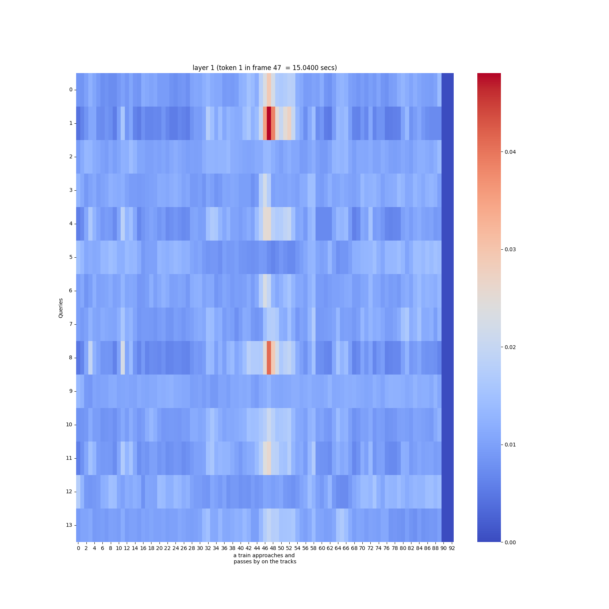
</p>
<p align="center"><a id="fig-example-demo"></a><em>Figure 6: token etc</em></p>

train

<a id="objective4-examples2"></a>

#### Example 2

- Decoded sentence: ```people are talking in the background as a person is walking```
- Audio:

<p align="center">
  <audio controls>
    <source src="doc/audios/Small_Eatery.wav" type="audio/wav">
    <a href="doc/audios/Small_Eatery.wav">Small_Eatery.wav</a>
  </audio>
</p>


- Attention map for all layers:

<p align="center">
  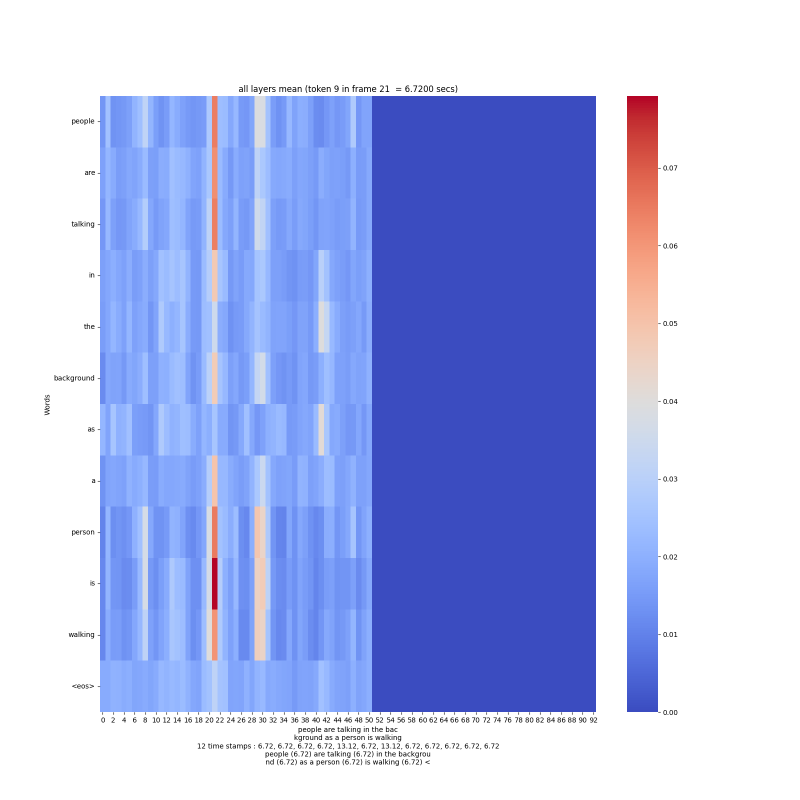
</p>
<p align="center"><a id="fig-example-demo"></a><em>Figure 4: Attention map example</em></p>


- Audio waveform:

<p align="center">
  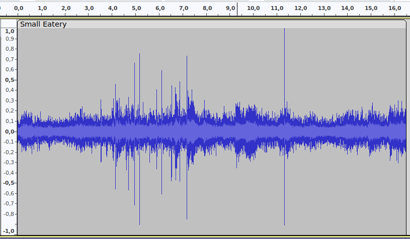
</p>
<p align="center"><a id="fig-example-demo"></a><em>Figure 5: Audio</em></p>


<a id="objective4-examples3"></a>

#### Example 3

- Decoded sentence: ```text here```
- Audio:


- Attention map:


- Audio waveform:


<a id="objective4-examples4"></a>
#### Example 4

- Decoded sentence: ```text here```
- Audio:


- Attention map:


- Audio waveform:


<a id="objective4-examples5"></a>
#### Example 5

- Decoded sentence: ```text here```
- Audio:


- Attention map:


- Audio waveform:


<p align="right">(<a href="#readme-top">back to top</a>)</p>

## Contributing

Thanks to the following contributors:
- [Martí Umbert](https://github.com/mumbert)
- [Victor Cuevas](https://github.com/victorcuevasv)
- [Roger Vergés](https://github.com/eirasroger)
- [Roger Calaf](https://github.com/Rcalaf)

<p align="right">(<a href="#readme-top">back to top</a>)</p>


## References

<a id="dcase2024"></a>DCASE. (2024). Detection and Classification of Acoustic Scenes and Events (DCASE) Challenge 2024. DCASE. https://dcase.community/challenge2024/

<a id="drossos2017"></a>Drossos, K., Adavanne, S., & Virtanen, T. (2017). Automated audio captioning with recurrent neural networks. *2017 IEEE Workshop on Applications of Signal Processing to Audio and Acoustics (WASPAA).* [https://doi.org/10.48550/arXiv.1706.10006](https://doi.org/10.48550/arXiv.1706.10006)

<a id="Labbe2023"></a>Labbé, É., Pellegrini, T., & Pinquier, J. (2023). CoNeTTE: An efficient audio captioning system leveraging multiple datasets with task embedding. https://doi.org/10.48550/arXiv.2309.00454


<a id="Mei2021"></a>Mei, X., Liu, X., Plumbley, M. D., & Wang, W. (2021). Audio captioning transformer. Detection and Classification of Acoustic Scenes and Events (DCASE 2021). https://doi.org/10.48550/arXiv.2107.09817

<a id="Mei2021b"></a>Xinhao Mei, Qiushi Huang, Xubo Liu, Gengyun Chen, Jingqian Wu, Yusong Wu, Jinzheng Zhao, Shengchen Li, Tom Ko, H Lilian Tang, Xi Shao, Mark D. Plumbley, Wenwu Wang (2021). An Encoder-Decoder Based audio captioning system with transfer and reinforcement lerning. https://xinhaomei.github.io/files/audio_captioning_with_transfer_and_reinforcement_learning.pdf

<a id="Mei2022"></a>Xinhao Mei, Xubo Liu, Mark D. Plumbley and Wenwu Wang (2022). Automated Audio Captioning: An Overview of
Recent Progress and New Challenges. https://arxiv.org/pdf/2205.05949

<a id="Kouzelis2023"></a>Theodoros Kouzelis, Vassilis Katsouros (2023). Weakly-supervised Automated Audio Captioning via text only training. https://arxiv.org/pdf/2309.12242

<a id="Jberg2023"></a>Jan Berg, Konstantinos Drossos (2023). Continual Learning for Automated Audio Captioning Using The Learning Without Forgetting Approach. https://arxiv.org/pdf/2107.08028


<p align="right">(<a href="#readme-top">back to top</a>)</p>